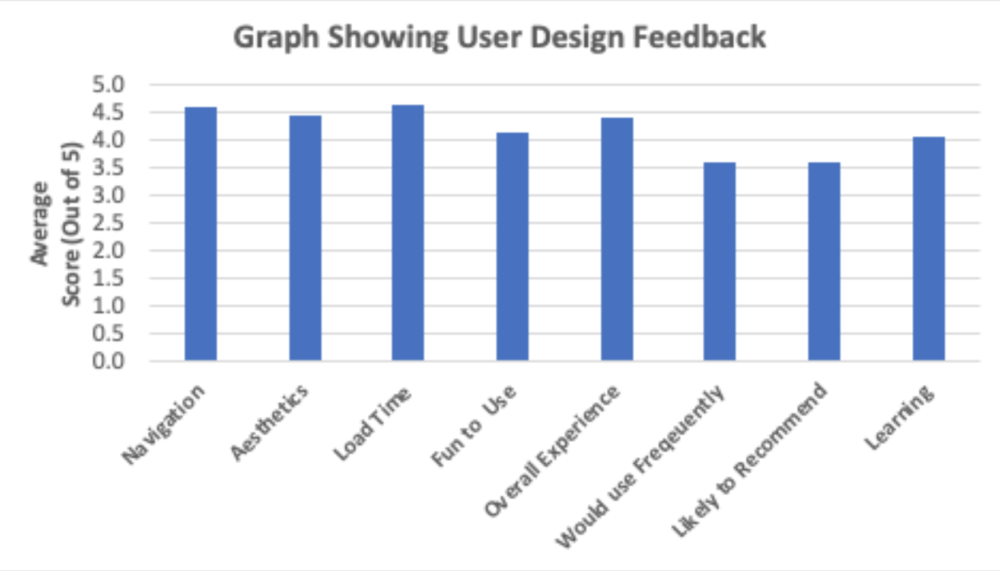
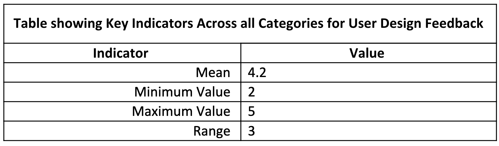
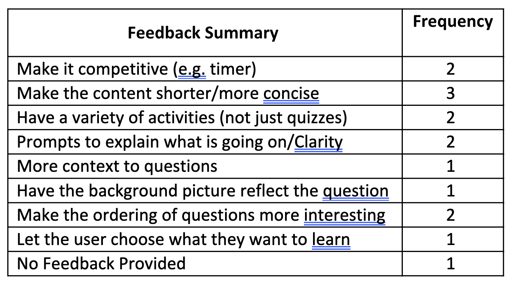
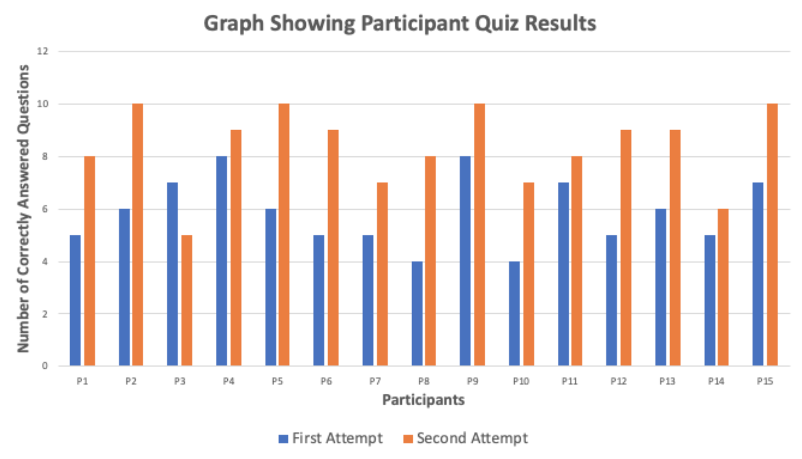
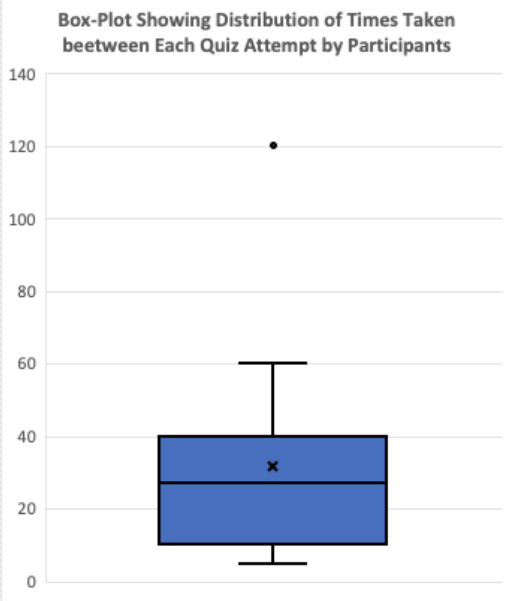

# EVALUATION 

### User Feedback 

Feedback on the design for this project was obtained via questionnaires that were circulated to our users. The questionnaires contained a combination of both qualitative and quantitative feedback to ensure a wholistic analysis of the results could be conducted. A copy of the questionnaire can be found in [Appendix B](Report/appendixB.md). Due to several reasons, including some unforeseen external pressures, we were unable to perform user testing or circulate the questionnaires until the very end of the project timeline. This meant we had much less time to source participants that met the requirements of our target audience (I.e., university students). Despite this, we managed to gather 15 participants to participate in the user testing stage of this project.  

The quantitative section of the questionnaire focused on the aspects of the design that the team were interested in. These included concepts such as: navigation, aesthetics, platform and ability to learn effectively from the product. Each question was posed with a positive spin to ensure that high scores would correspond to more positive feedback and low scores correspond to more negative feedback. It was agreed that a 5-point Likert scale would be the most appropriate option for this project. We felt that any fewer than 5 options would be too vague and would make it difficult for the user to reflect their true feelings about the product. Having more than 5 options would dilute the differences between corresponding points, which could make it difficult for the user to distinguish between. It was also important to provide users with an odd number of options where the middle option was left neutral. Although having an even number would force the user to make a decision as to which side they were on, it seemed unfair to overlook the fact that indifference could be a valid option (Jamison, S, n.d.). 

The 5-point Likert system we implemented presented users with the following options: 

1. Strongly Disagree 

2. Disagree 

3. Neither Agree nor Disagree 

4. Agree 

5. Strongly Agree 

These were later assigned a number between 1 and 5, with 1 representing ‘Strongly Disagree’ and 5 representing ‘Strongly Agree’. These conversions were made so that a quantitative analysis could be carried out on the data.  

### Results 

_**Design Feeback - Quantitative**_ 

The results of the quantitative feedback obtained from participants is shown below. The questions have been replaced with the respective categories they relate to: 

 

 

 

The above data has a range of 3, which at first glance could give the impression that the data is quite sporadic. Of the 5 potential responses, 4 of these have been used ranging from a minimum value of 2 to a maximum of 5. However, if we consider the mean of the data, we can see that overall, participants rated the application as a 4.2. This suggests that very few data points fell below this value, which can be observed in the graph above. The graph shows a relatively consistent set of bars centered around the mean with only 2 of the 8 bars dipping below a score of 4. 

Design Feedback – Qualitative 

The Following results show the feedback obtained from asking users about what they would like to change/see differently in the application: 

 

The above table shows that the most frequent request by users was to have less content on the page, with only one participant requesting that more context be given. Participants also outlined that the game was not engaging enough and would like to see either a competitive aspect to it, or more variety in the activities available (or perhaps even both). They were also keen to see a more interesting ordering of questions as opposed to the same questions in the same order every time. Other comments suggested that it was not always clear what was being displayed on the screen or what purpose it served and others related more to the aesthetics of the application and how it could be improved.  

_**Quiz Results**_ 

In the time we had left ourselves, we were able to get feedback from 15 participants through opportunity sampling. Due to Coronavirus restrictions, we were somewhat limited in our ability to approach people face-to-face. We therefore started with the people who were the easiest for us to access – namely, the family and friends that we live with or share a support bubble with. We presented these participants with a laptop that had the application set up on it and were able to observe as they navigated their way through the application.  

The second category of people consisted of family and friends that we could only interact with virtually. These participants were asked (one at a time) to join a Zoom meeting that we had set up, where we could share our laptop screen and give them control of the mouse and keyboard. This allowed them to navigate the application remotely from their own computers, while still allowing us to observe their interactions with the software. 

In order to determine whether the application was actually helping to educate people about culture, participants were asked to conduct the quiz twice, with a 30 minute separation between attempts. This separation was included to allow sufficient time to elapse for the quiz answers to leave the participants’ short-term memory. By taking the quiz twice, we were able to compare the participants initial scores (before using the app) and final scores (after using the app). Comparing these two indicators allowed us to determine the degree to which participants were able learn about culture from the application. 

For the participants who we could contact directly, this was fairly straightforward to implement, since we were able to simply return to them after the 30 minute break and request them to take the quiz again. However, for the participants on Zoom, we found this to be a little more challenging. Not everyone was free during the testing windows we had set and so some participants opted to retake the quiz after a shorter interval, whereas others decided to leave a longer interval before returning again when they were more free. This meant that the elapsed time between successive attempts was not able to be kept constant from user to user. However, we attempted to get as close as possible to the 30 minute target as was feasible. 

 so that results could be compared before using the application and after using the application. The participants were told to leave a 30 minute gap between each trial to ensure answers were not simply being crammed. Participants were then asked to submit their results on the feedback questionnaire. The results provided by the participants are shown below: 

 

The above graph shows that 14 out of the 15 participants scored better on the second attempt than on the first attempt. However, it is important to consider the elapsed time between the two attempts. A box-plot of this information is presented below: 

 

The above box-plot show a very wide range of data for the time elapsed between each quiz attempt, spanning from 5 minutes to 120 minutes, with the 120 minute data point considered to be the outlier. The interquartile range is much narrower, with approximate values ranging from around 40 minutes. It is important to take this into consideration before attempting to determine whether or not a fair test has been carried out. 
