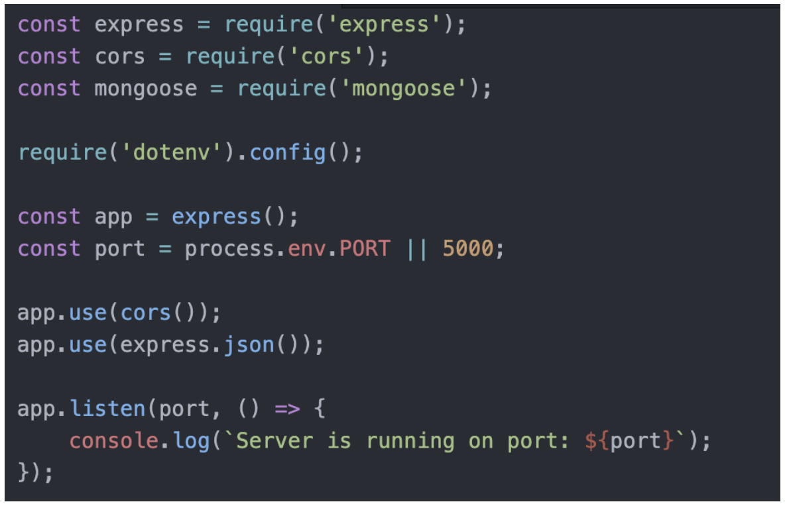
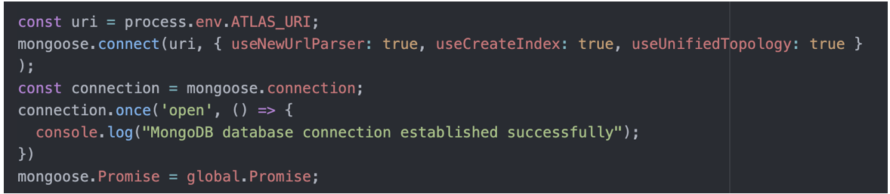
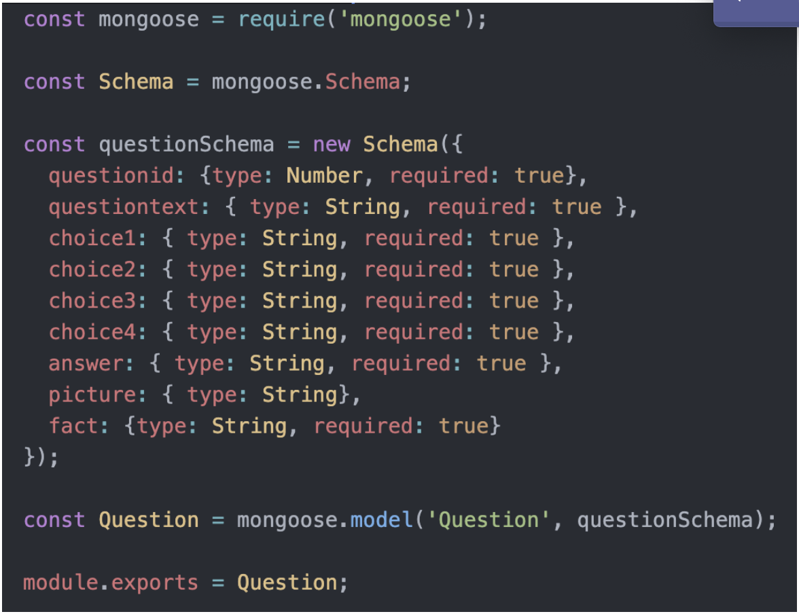
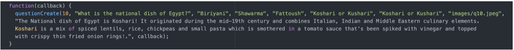
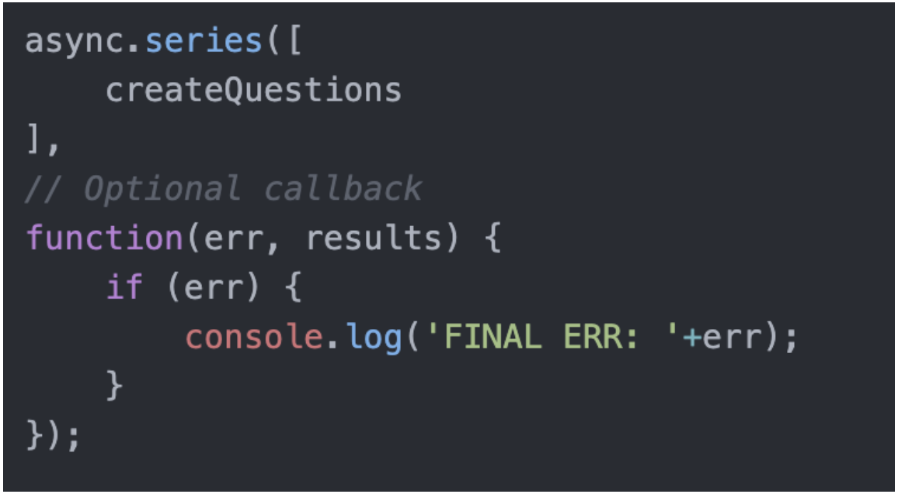
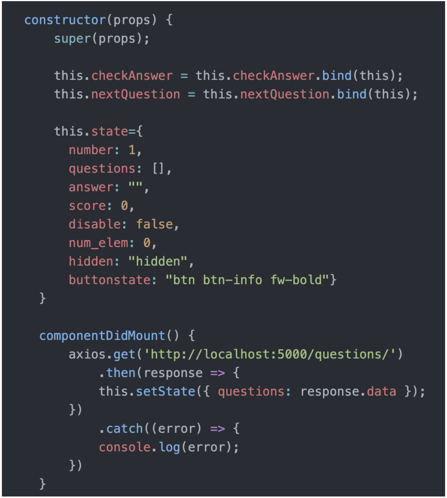
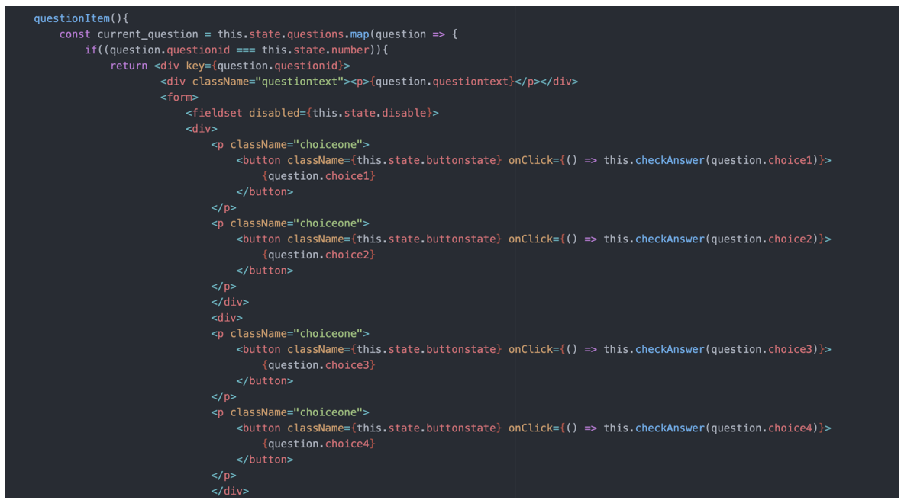
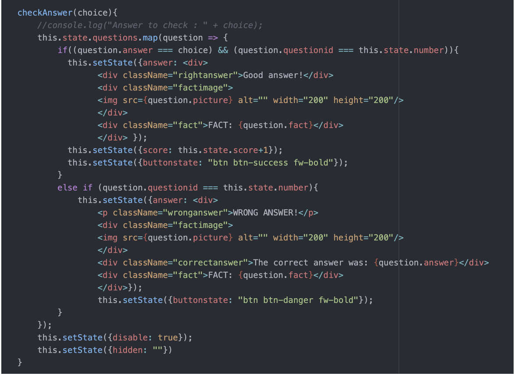
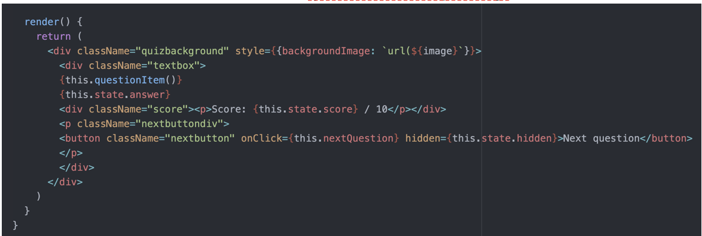

# SYSTEM IMPLEMENTATION

### Implementing the MERN (MongoDB, Express, React and Node) Stack: 

To implement the MERN application we took a four step approach. First, we configured the backend API, i.e. the server side, by connecting Express and Node to MongoDB and the front end. After the creation of the API, we built the frontend using ReactJS to design the user interface. Finally, we linked the frontend and backend inside of the javascript classes in ReactJS. We used the resources on the SEGP GitHub and the following logRocket MERN Stack Tutorial to guide us through the process: https://blog.logrocket.com/mern-stack-tutorial/#rest. We also used most of the following Medium website: https://medium.com/@beaucarnes/learn-the-mern-stack-by-building-an-exercise-tracker-mern-tutorial-59c13c1237a1  

The first step we took was to run ‘npm init’ in the ‘backend’ folder to initialise the project with a package.json file and we accepted all the default packages. We then installed all the dependencies which we thought would be useful for our project using the ‘npm i’ command. The dependencies we installed were; express, mongoose, dotenv, cors and async.  

To make the development easier, we also thought it was a good idea to install nodemon as this would allow us to see live changes to our web app with every saved change to the source code meaning that we wouldn’t have to re-run the server every time we wanted to see a new change. To do this, we ran the following ‘npm i -D nodemon’. Once this was set up, we then set the entry point through the server.js file as seen below: 

Express uses Node and MongoDB to create the backend of the server part of the project. We have also set the port to either process.env.PORT or if there is nothing there, to port 5000. 

After this was set up, we then went on to set up the database through MongoDB ATLAS as it is a cloud hosted database and so allows our database to be accessed globally. To do this we created an account, built a cluster and then connected it to our application via MongoDB ATLAS. This then led us to our database link (ATLAS_URI) which we input into a .env file and connected it to our server via mongoose using the following code in the server.js file: 

We then needed to add another dependency package called ‘config’ which would provide us with the global variable to be able to run the app. As the database had been successfully connected, we went on to build our route set up and RESTful API.  

In our ‘routes’ folder, we created a file called questions.js which contained our API. This API defines all the routes that can be used between the server and database and creates the CRUD operations. In this project we only used the C (create) and R (read) operation as we did not need the two other ones.  

We also needed a database model for each of our documents in order to interact with our database. To do this we created a schema in the ‘models’ folder in the ‘backend’ folder called question.model.js. Here we defined what every document inserted into our database should look like in order to be successfully added. The schema reflected what we wanted our quiz format to look like and so included: the question ID (so we knew which question was being added to the database and so that we had an identifier to retrieve it by via the API to be displayed on the frontend), questiontext (the question itself), choice1 - choice4 (as it is a multiple choice quiz), answer (to determine which the correct answer is), picture (an image which is related to the question), fact (to accompany the picture and provide more information about the topic being asked). Here is the schema: 

To populate the database, we wrote a script in the server.js file (we could have done it in a separate file which would have been cleaner) with all the documents (questions, facts, images etc) that we wanted to be added to the database. We first wrote all the data in a function called ‘createQuestions’ and input the data in the same order as the schema shown above e.g.: 

‘questionCreate’ shown above was used to define every question entry. We then used ‘async.series’ to call all the functions in ‘createQuestions’ and insert them into the database. 

This process completed the backend of the application. 

### Front End - React. Details of implementation. 

To create the user interface we used ReactJS. At first it was tricky to get to grips with React as resources online often used JSX where you could write HTML, CSS and JavaScript all in one file. The syntax of JSX was extremely confusing to get to grips with at first so to make things easier we started to style the app using bootstrap as much as possible. Using bootstrap was useful as it is extremely straightforward to use and has a lot of built-in components which are ready to use such as different button sizes, button shapes and colors. However, as we went along and the styling requirements became more complex, we decided to shift towards using a traditional separate CSS file. Doing this allowed us to be more specific with styling which was necessary when trying to achieve specific font-colors, placing buttons in a particular place on the page, inserting background images and more. As a result, the code for styling of our app can partially be seen in the ‘question-item.component.js’ and the ‘start-quiz.component.js’ and partially in ‘index.css’.  

 In order to get the quiz questions to display on the front end we needed to access the questions in the database via the API. To do this we used the Axios library to send HTTP requests to our backend and to retrieve the database documents in order to save all the questions to an array visible in our javascript class. The following code shows how this was implemented in the ‘question-item.component.js’ file: 
 
 
 
 In the constructor we create a number of states which re-render every time the state has been changed using setState(). Here we create a state called questions of type array, and assign the data that is retrieved by axios.get() to the questions array. The data that is retrieved by the axios.get() function are the documents in our MongoDB database which contain everything that has been detailed in the schema. Since this gave us access to this data on the client side, we were then able to integrate the information with our HTML and CSS to render it on the page and display each question with its respective information (answer choices, picture, fact etc) one by one by looping through the questions array. We can access each part of the schema using the ‘.’ operator after questions and naming the part of the schema we want to access e.g. ‘question.fact’ gave us access to the fact of the current question. How we set up the quiz page before the user selected an answer choice is shown in the code below and has been taken from the ‘question-item.component.js’ file: 
 
 
 
 Each time the user picks an answer option, we want the relevant fact, picture, their current score out of 10 and whether they got the answer right or wrong to be displayed on the page. To do this, the checkAnswer() function was called every time a choice was picked by the user. The function then checked to see whether the answer they got was right or wrong and accordingly displayed the correct message - either Good answer! Or Wrong answer! respectively - and then displayed the correct image and fact and a button to go to the next question. This code can be seen below from the ‘question-item.component.js’ file: 
 
 
 
 To get everything rendered on the screen, the render() function was called every time a change happened i.e. every time a user pressed a button the page would re-render appropriately as seen in the code below from the from the ‘question-item.component.js’ file: 
 
 
 
 ### DEPLOYMENT DETAILS: 
 
  We were unable to successfully deploy the app on docker however, we did try various solutions. We tried using docker container to deploy the app by writing three separate files; A Dockerfile for the frontend, a Dockerfile for the backend and docker-compose.yml in the main project directory. When running this there were several error messages that occurred that we were unable to solve due to time restrictions. Although the frontend of our app seemed to run successfully on Docker, it was unable to connect to the database.  

 Additionally, we were unable to use continuous integration to the extent that we had hoped to in this project. The reasons for this and what we would do differently next time to use continuous integration has been discussed later in this report. 
 
 
 
 
 
 
 
 
