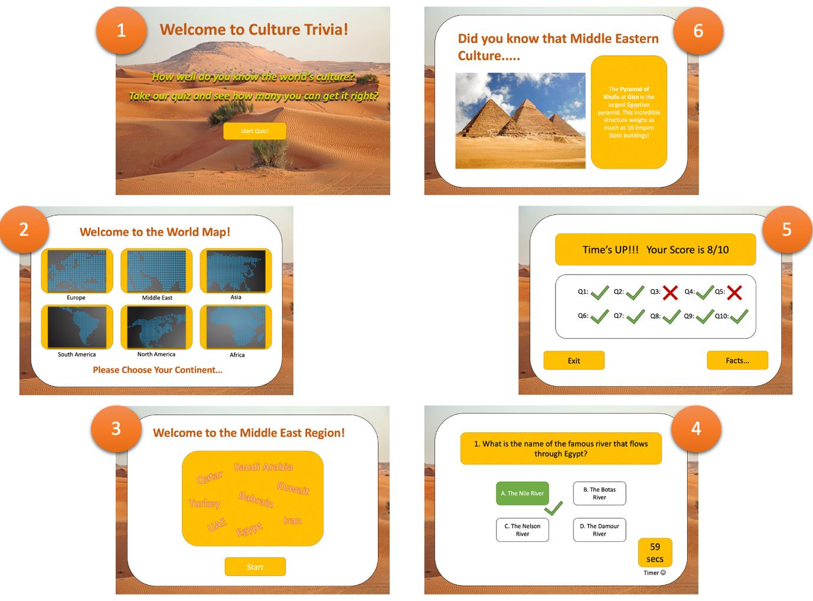

# UX DESIGN 

### Design process and early prototyping: 

The design phase of this project was based around the Double-Diamond workflow (Ball, J, 2019) and consisted of 4 separate phases, namely: 

Discover – the gathering of information about potential problems that could use solutions. 

Define – narrowing down the selection to a single problem to solve. 

Develop – determining a range of potential solutions that could be implemented to solve the problem. 

Deliver – choosing a single solution to focus on with the aim of solving the problem. 

Although the framework separates these four areas, it is sometimes useful (particularly during the brainstorming process) to consider the potential problems and potential solutions together. In order to achieve this, an ‘Index Matrix’ was used to brainstorm different options. An idea matrix is simply a table with a list of problems running down the rows and a list of solutions running across the columns. The aim is to pair as many ideas to the given solutions as possible, thus creating a pool of problems attached to potential solutions to that problem. This proved to be incredibly helpful in opening our minds to new and creative ideas. The identity matrix used by the team is shown below: 

  

After conducting this exercise, the team’s initial thoughts were to create an application that would educate people about different cultures from across the world using a ‘ball & goal’ game. The idea was to create a game that involved shooting a ball at a target (perhaps a hoop) and points would be allocated for successful shots. However, if a shot was missed the player would be required to correctly answer a question about culture correctly in order to stay in the game. Ideally, we would have liked to implement this idea. Not only would the game be fun to play, but it also introduced an element of competition and provided users with an incentive to learn. 

However, we soon realised that implementing such an application would be overly technical for the timeframe we were given – particularly since we were still relatively new to the MERN stack, which we were using. We therefore decided to create a quiz instead. This was a reasonable compromise as it would still achieve everything the ball game would but would have the added benefit of making the implementation process much simpler. 

Once we had decided on the problem-solution pair we were going to tackle, the next step was to decide how the application was going to be presented to the user. We wanted the pace of the quiz to be sufficiently quick in order to keep the player’s attention. Consequently, we decided on a multiple-choice format for the quiz as this would minimise the amount of writing the user would have to input for questions. In order to determine what the application would look like visually, decided to create a paper prototype. Traditionally this is done using physical paper, however, due to Coronavirus restrictions the team was unable to meet in person. We therefore decided to mimic this process electronically using the draw feature offered by Microsoft PowerPoint. During this meeting, we were able to map out the general flow of the quiz and a vague idea about its appearance. We were also able to brainstorm some of the intricacies we wanted to include, such as the ‘fun facts’ about countries that would be presented to the user at different stages of the quiz. The results of this brainstorming session are shown below: 

_**Initial Prototype**_ 

 

_**Advanced Prototype**_ 

(See Appendix A for Expanded Versions of these Images): [Appendix A](blob/main/Report/appendixA.md)

 

### UX Approach – Design heuristics and methods: 

In an article published by the Interaction Design Foundation, and outline of the ‘Ten Commandments’ of heuristic evaluation (Heuristic Evaluation, n.d.) is provided. Of these ten rules, the following are the ones most relevant to this project and have been summarised as follows: 

1. Show users information in a way that is easy to understand and familiar. 

2. Offer users control by allowing them to undo errors easily. 

3. Be consistent with buttons so users aren’t guessing what to click. 

4. Have information visible where necessary so that users aren’t trying to recall information from memory when this is not required. 

5. Have no clutter and keep only relevant information in view. 

These rules provide a good guideline as to what an application should contain in order to be considered ‘usable’.  

In order to display information in a way that would be easy for users to understand, the formatting for each question was kept consistent throughout the entire quiz. This provides a sense of familiarity for the user and allows them to focus their attention on answering the quiz questions rather than trying to adapt to new layouts. With regards to the colours used, we decided to stick to familiar associations such as red, for an incorrect answer and green, for a correct answer. This also adds to the sense of familiarity to the user and gives the application a more intuitive feel. The navigation buttons used were displayed in a set location so that users wouldn’t have to guess where buttons might be, and the formatting of these buttons was kept consistent throughout.  

It was also important to only provide users with the minimum amount of information they would need in order to play the quiz. We wanted to keep the focus on playing the quiz and keep the pace of the quiz moving to ensure the users attention doesn’t drift too often. For this reason, users are initially provided with just the question and the four potential answers to pick from, eliminating all other distractions. It is only once the user has selected an option that addition information is offered (which they have the choice to skip over if they are not interested in reading it). For users that are interested in reading the additional information, they may also want to see what answer they chose and compare their choice to the new information provided. We therefore decided to also leave the question on the screen along with the users’ selection, so they have the freedom to analyse their choice in more depth if they so wish.  

**Interaction flow diagram:** 

 
